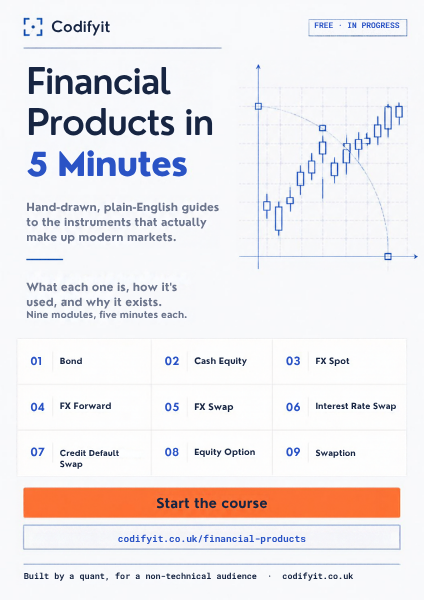
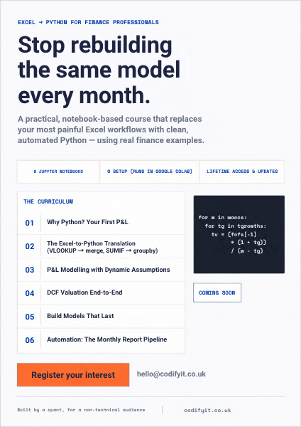
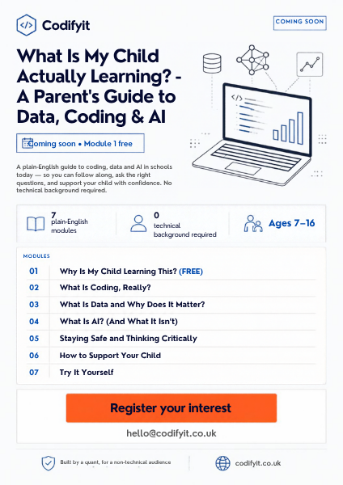
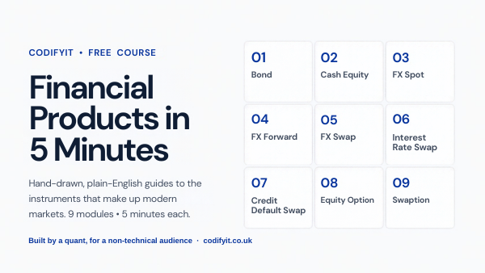
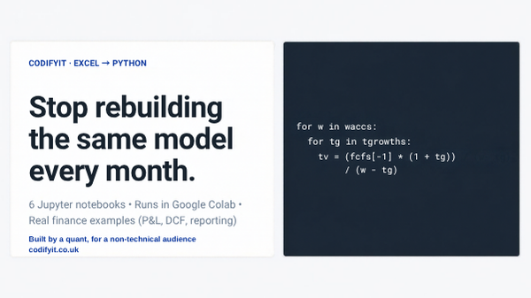
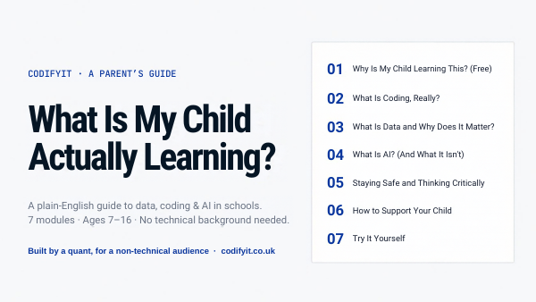

# Marketing assets

Course flyers and Gumroad cover images, designed in Canva using the site's
brand palette (see `tailwind.config.js`): background `#f8f9fa`, Ink Navy
`#0f172a`, Royal Blue `#0a369d`, coral `#ff6b35` for CTAs only, and borders
`#e2e8f0`.

The source files are the Canva designs. The images in `previews/` are
low-resolution previews only. Download full-size files from Canva.

## Print / social flyers (A4 portrait)

| Course | Canva | Preview |
| --- | --- | --- |
| Financial Products in 5 Minutes | [view](https://www.canva.com/d/V-1atRGfbgS5Awo) |  |
| Excel to Python for Finance Professionals | [view](https://www.canva.com/d/TuzE7le5AAzIzUu) |  |
| What Is My Child Actually Learning? | [view](https://www.canva.com/d/7xzPwrMwpOhPFit) |  |

Export for print with **Share → Download → PDF Print**.

## Gumroad covers (16:9, 1920×1080)

| Course | Canva | Preview |
| --- | --- | --- |
| Financial Products in 5 Minutes | [view](https://www.canva.com/d/AbAjAp-kapZqCZQ) |  |
| Excel to Python for Finance Professionals | [view](https://www.canva.com/d/Y1kqWaMZgm0a0d4) |  |
| What Is My Child Actually Learning? | [view](https://www.canva.com/d/SX2CvpAurfpVOOS) |  |

Export with **Share → Download → PNG** and upload the file as the product's
cover image on Gumroad. The covers have no buy button, because Gumroad
adds its own.
